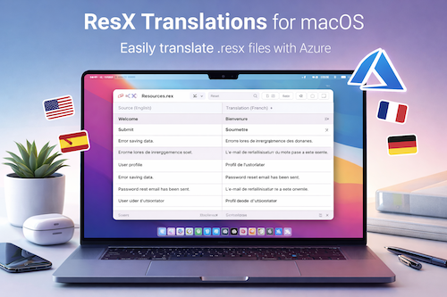

# ResXTranslation4Mac   

## Translate any resx type of file from the MacOS

Welcome to **ResXTranslation4Mac**, this saves time by utilizing Azures Translator.

Don't forget to [star (🌟) this repo](https://docs.github.com/en/get-started/exploring-projects-on-github/saving-repositories-with-stars) to find it easier later.

➡️Get your own copy by [Forking this repo](https://github.com/offroadn/ResXTranslation4Mac/edit/fork) and find it next in your own repositories.

## ✨ What's New

We're constantly improving this solution so check back often:

- **🚀 Initial Release**

## 🚀 Setup
- Before running the solution, make sure the config file for running the app is pointing to MacCatalyst. You may have to manually edit this.

## 🚀 Running the App
- Go to **Settings**
  * Add the Azure Translator Key (apikey) generated from the Azure portal
  * Add the Azure Translator Endpoint - this defaults in
  * Add the Location/Region - (Global, eastus, etc...)
  * Save
- **ResX Page**
  * Add the name of the Resource file without its extension
  * Add the Key that you want to add or edit
  * Add the Value
  * Pick the location of the ResX file in your project
  * Check/Uncheck any languages that you need to
- **Apply**
  * This will add/update all the resx files with the key/value
